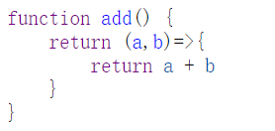
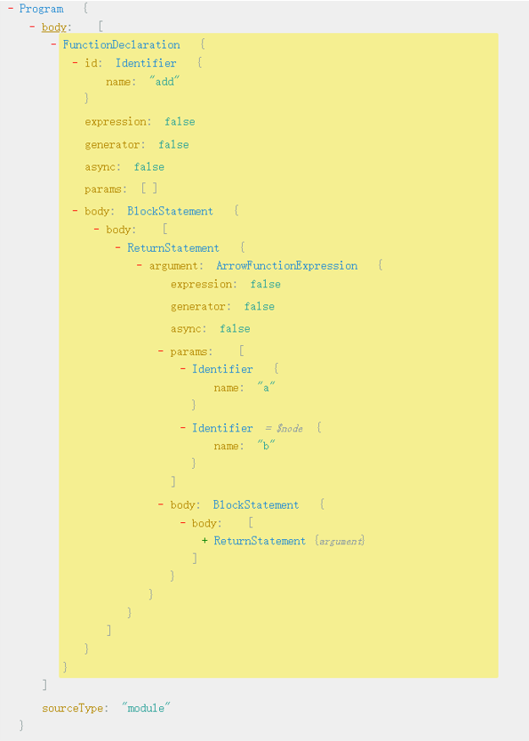
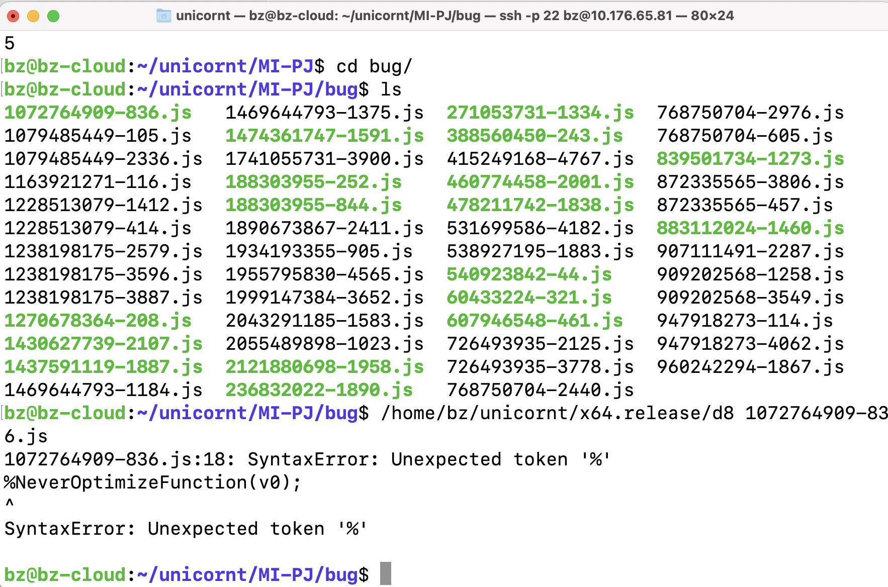
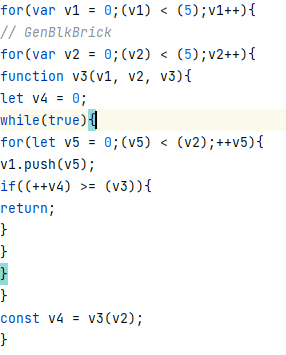
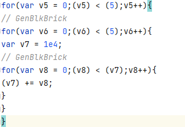

# 《基于 CodeAlchmest 的引擎测试和改进思考》报告

18307130104 赵文轩 

[toc]

## 项目说明

项目以三个较为小众的 Javascript 引擎（[quickjs](https://github.com/bellard/quickjs) ，[graaljs](https://github.com/oracle/graaljs#current-status)，[hermes](https://github.com/facebook/hermes)） 为目标，希望通过对 CodeAlchemist 工具的改动和运行，找到 Runtime 中的漏洞。

quickjs 是一个轻量化的 Javascript 引擎，采用 C 语言实现，广泛应用于嵌入式设备中。

graaljs 是一 Oracle 开发的 Javascript 引擎，将 JS 代码运行在 GraalVM 上。

hermes 是 Facebook 开发的 Javascript 引擎，为 [React Native](https://reactnative.dev/) 程序进行了专门的优化。

## AST

在描述 CodeAlchmest 工具运行的原理之前，首先需要了解 AST（**A**bstract **S**yntax **T**ree，抽象语法树）。

AST 是 JS Runtime 对源码进行运行的一个预处理，将人类能够看懂的语言转换为机器比较好理解的形式。AST 的分解结果主要分成两大类：声明和表达式。声明(Declaration)：包括类声明，变量声明，函数声明，表达式(Statement)：对应不同的语句块，如 ReturnStatement，BreakStatement 等等。

通过这两种方式的分解，将程序拆分成底部为 Identifier 和 Literal 的树形结构，JS 代码和 AST 的对应方式如下图所示。





AST 的功能不仅仅在于为 Runtime 提供代码转换运行的桥梁，更是修改代码的一把螺丝刀。考虑一下应用场景：我们希望在每个函数调用之前输出一些特定的信息，如果手动添加无疑是一个非常大的工作量，但是如果运用 AST 进行修改，那么就可以实现全自动化的修改。

代码可以在 [change.js](./AST/change.js) 查看，代码会检测已定义的函数，利用 AST 查找所有的显示和隐式函数调用，采用直接调用和为现有函数套壳的方法，插入输出信息的语句。具体例子和结果可以在 AST文件夹下的各个文件中查看。

## CodeAlchemist

CodeAlchemist 在论文 [CodeAlchemist- Semantics-aware code generation to find vulnerabilities in javascript engines](./doc/CodeAlchemist- Semantics-aware code generation to find vulnerabilities in javascript engines.pdf) 中提出。整个工具采用 F# 语言实现，对多线程运行有比较好的支持。

CodeAlchemist 采用 Fuzzing 的方法对种子文件进行打乱重组，并通过对种子文件的进行数据流的分析，尽可能减少诸如变量未经定义等等运行错误。整个工具没有对代码运行的结果进行检验，而是仅仅检查代码能否正确运行。

### 配置运行

将种子代码文件放置到 seed_program 文件夹中，将目标引擎移动到根目录下的 conf 文件（1.conf，2.conf，3.conf）中引擎位置或修改 conf 文件。依次运行如下命令开始进行 fuzz 操作。可以在 proc_program 文件夹中查看包括 AST，重写的 JS 代码，重写的 JS 代码输出的结果。tmp 文件夹中查看当前进行迭代的代码文件，发生运行错误的文件将会被储存到  bug 文件夹中。

```
$ dotnet bin/Main.dll rewrite <conf ABSPATH>
$ dotnet bin/Main.dll instrument <conf ABSPATH>
$ dotnet bin/Main.dll fuzz <conf ABSPATH>
```

### 原理分析

对于每个种子文件，程序会进行数据流分析，得到每个代码段的 precondition 和 postcondition。 precondition 用于标记这个代码段需要用到的变量以及其类型，postcondition 用于给出这个代码段正确运行后定义的变量以及其类型。为了达到这个目的，程序会对每个种子文件进行 rewrite 操作，在每个代码块前后进行插桩（插入输出状态的代码）操作，运行代码后的输出中可以得到所有代码段的 precondition 和 postcondition。

之后对所有种子文件的代码段进行整合，每步操作可以选择插入单个语句，插入代码块，插入无内容的框架（如循环框架，条件语句框架），生成测试代码，输入到提供的引擎中并进行检查，代码会一直迭代直到找到 Bug。

### 配置修改

由于原工程只支持特定的 JS 引擎，想要测试上述三个引擎，需要另外进行配置。配置包括对引擎运行方式进行设定，引擎运行时参数进行修改，以及插桩代码对引擎进行适配。具体修改可以在 /src/Fuzzer/Oracle.fs，/src/Common/Conf.fs，/src/Analyzer/jsLib，主目录下 conf 文件中查看。

### 种子文件选择

作者并没有说明种子文件的选择。我选择了 [test262](https://github.com/tc39/test262/tree/main/src) 这一经典的 JS 引擎测试代码集作为种子文件进行试运行，遗憾的是，找到的 Bug 均不是引擎自身的问题。

### 结果说明及分析

经过长时间的运行，程序确实找到了能够使目标引擎运行错误的文件，但是经过我的筛选，没有能够说明引擎存在问题的文件。导致运行错误的类型包括：死循环，种子文件中自带的抛出错误函数被重组后直接触发，甚至出现下图所示的语法错误。



死循环示例



可以看到调用函数 v3 时仅仅传入了一个参数，导致 v3 为 undefine 从而造成死循环。这是因为在数据流分析中仅仅做了关于变量类型的检测，没有对函数的参数列表进行计数和类型分析。



上述代码中，循环中每次对循环上限 v8 进行了增加，导致循环无法停止。这种情况在这种随机打乱代码的程序中确实很难进行预先检测。

考虑到上述问题的出现，可以发现 CodeAlchemist 的缺点在于没有对函数的参数列表进行分析和记录，同时由于其基于种子代码进行分析的特点，导致生成的代码很大程度上受制于种子代码的格式，由于我选择的代码集是所有引擎必须测试的 test262，所以生成的代码即使经过几千次的迭代，也很难找到 Bug。

## 构思的改进

基于上述实验，我构思了两个改进的方法：基于 EMI 的代码生成；能够比较结果的代码生成。

### 基于 EMI

EMI 的概念首次在论文 [Compiler Validation via Equivalence Modulo Inputs](./doc/Compiler Validation via Equivalence Modulo Inputs.pdf) 中被提出。原论文描述了对于 C程序进行代码段分析，找到和源程序等价的程序检验是否能够运行。考虑到 JS 是一门解释性语言，我们对 EMI 的寻找方法做如下的修改：利用 rewrite 阶段重写的代码输出的 precondition 和 postcondition，找到程序中对后续代码运行变量列表不进行改变的代码段进行删除替换。

这种改进方法的优点在于，不容易出现上述运行错误，但是与 Fuzzing 的结果相比，更加受到种子代码结构的桎梏，因此对于种子代码的选择更加需要谨慎，最好可以采用较长的实际投入使用的代码。

### 比较结果的代码

之前所有的寻找目标都是使程序崩溃的代码。考虑通过整合所有代码段的 postcondition 来得到整个程序的 postcondition，并输出所有的变量进行比较。生成代码后，将目标引擎的输出文件进行比较，如果出现差异，则说明其中一个引擎出现了问题，反馈这段代码作为可能的 Bug 文件。

## 总结

本次项目基于 CodeAlchemist 对多个引擎进行了测试，在效果不是很好的情况下，对 CodeAlchemist 进行了分析，并在此基础上提出了改进措施。

进行项目的过程中我阅读了两篇比较经典的论文，让我对引擎以及编译器的测试方式有了一个了解。